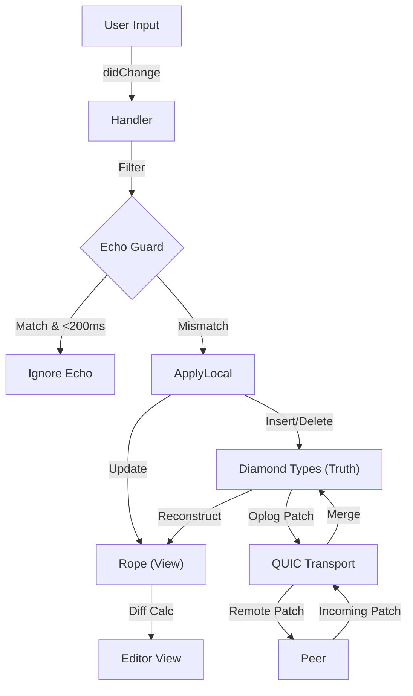

# JustSync

[]()
[]()
[]()

**JustSync** is a high-performance, real-time code synchronization tool designed for Neovim and LSP-compliant editors.

It utilizes **CRDTs (Conflict-free Replicated Data Types)** for mathematical consistency and **QUIC** for low-latency transport, ensuring that collaborative editing feels native, even over unreliable networks.

> **⚠️ Alpha Warning:** This software is currently in active development (v0.1.0). While the core synchronization logic is stable, edge cases may still exist. Use with caution on critical data.

---

## 🚀 Key Features

* **Conflict-Free Editing:** Powered by [diamond-types](https://github.com/josephg/diamond-types), JustSync merges concurrent edits automatically without conflicts using state-of-the-art CRDTs.
* **Blazing Fast Transport:** Uses **QUIC** (via `quinn`) instead of TCP/WebSockets, reducing head-of-line blocking and latency.
* **Cursor Stability:** Implements an efficient differential update algorithm (`ropey` + custom diffing) to ensure the cursor never jumps or resets during remote updates.
* **Echo-Loop Protection:** Features a robust, timestamp-based "Echo Guard" that intelligently distinguishes between local user input and remote echoes, preventing infinite sync loops.
* **Editor Agnostic Protocol:** Built to interface with any editor that supports the Language Server Protocol (LSP) or standard stdin/stdout text manipulation.

---

## 🛠️ Architecture

JustSync solves the "Split Brain" problem of distributed editing by maintaining a local "Truth" (CRDT) and a "View" (Rope) separately.



### The "Echo Guard"
One of the hardest problems in LSP synchronization is the "Echo Loop," where the editor sends back changes the network just applied. JustSync solves this using a Timestamped Content Lock. It verifies if the didChange event matches the expected state within a tight time window, silently dropping echoes while allowing concurrent user edits to pass through.

## 📦 Installation

### Prerequisites

- Rust Toolchain (latest stable)
- Neovim (v0.8+)

### Build from Source

```Bash
git clone [https://github.com/yourusername/justsync.git](https://github.com/yourusername/justsync.git)
cd justsync
cargo build --release
```

The binary will be located at ./target/release/justsync.

## 💻 Usage
JustSync operates in a Host-Peer model.

1. Start the Host
The host initializes the session and owns the authoritative project state initially.

```Bash
# Listen on port 4444
./justsync --host --port 4444
```

2. Connect a Peer
The peer connects via QUIC, performs a handshake, and downloads the full project state (CRDT history).

```Bash
# Connect to localhost (or remote IP)
./justsync --connect 127.0.0.1:4444
```

## 📝 Neovim Integration
I already have a working plugin for neovim, it can be found under `https://github.com/Tanzkalmar35/JustSyncNvimAdapter`.

## 📄 License
This project is licensed under the MIT License.
