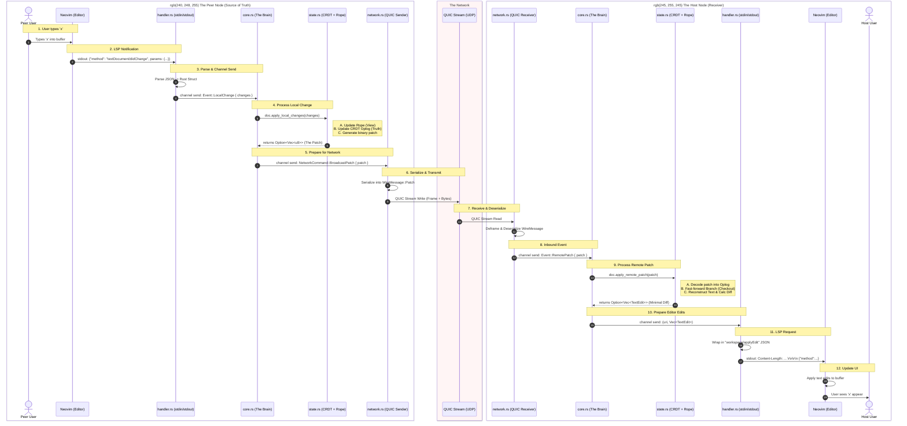

# JustSync

[]()
[]()
[]()

**JustSync** is a high-performance, real-time code synchronization tool designed for Neovim and LSP-compliant editors.

It utilizes **CRDTs (Conflict-free Replicated Data Types)** for mathematical consistency and **QUIC** for low-latency transport, ensuring that collaborative editing feels native, even over unreliable networks.

> **⚠️ Alpha Warning:** This software is currently in active development (v0.1.0). While the core synchronization logic is stable, edge cases may still exist. Use with caution on critical data.

---


https://github.com/user-attachments/assets/9f55f365-05b3-486a-89fd-d1e441ab1f36


---

## 🚀 Key Features

* **Conflict-Free Editing:** Powered by [diamond-types](https://github.com/josephg/diamond-types), JustSync merges concurrent edits automatically without conflicts using state-of-the-art CRDTs.
* **Blazing Fast Transport:** Uses **QUIC** (via `quinn`) instead of TCP/WebSockets, reducing head-of-line blocking and latency.
* **Cursor Stability:** Implements an efficient differential update algorithm (`ropey` + custom diffing) to ensure the cursor never jumps or resets during remote updates.
* **Echo-Loop Protection:** Features a robust, timestamp-based "Echo Guard" that intelligently distinguishes between local user input and remote echoes, preventing infinite sync loops.
* **Editor Agnostic Protocol:** Built to interface with any editor that supports the Language Server Protocol (LSP) or standard stdin/stdout text manipulation.

---

### A typical data flow would look something like



### The "Echo Guard"
One of the hardest problems in LSP synchronization is the "Echo Loop," where the editor sends back changes the network just applied. JustSync solves this using a Timestamped Content Lock. It verifies if the didChange event matches the expected state within a tight time window, silently dropping echoes while allowing concurrent user edits to pass through.

## 📦 Installation

### Prerequisites

- Rust Toolchain (latest stable)
- Neovim (v0.8+)

### Build from Source

```Bash
git clone [https://github.com/Tanzkalmar35/justsync.git](https://github.com/yourusername/justsync.git)
cd justsync
cargo build --release
```

The binary will be located at ./target/release/justsync.

## 💻 Usage

JustSync is designed to be used directly through your editor of choice via our dedicated extensions.

### Supported Editors
*   **Neovim:** [JustSyncNvimAdapter](https://github.com/Tanzkalmar35/JustSyncNvimAdapter)
*   **VS Code:** [JustSyncVSCode](https://github.com/Tanzkalmar35/justsync-vscode)
*   **IntelliJ IDEA:** [JustSyncIntelliJ](https://github.com/Tanzkalmar35/justsync-jetbrains)

### How to Connect

**1. Start the Session (Host)**
*   **VS Code / IntelliJ:** Click the **Start** button in the extension panel, select **Host**, and copy the generated **Secret Token**.
*   **Neovim:** Run the command `:JustSyncStart`. The token will be displayed in the messages area.

**2. Join a Session (Peer)**
> **⚠️ Important:** Peers must start in an **empty directory**. The initial sync will download the project state from the host.

*   **VS Code / IntelliJ:** Click **Start**, select **Join**, enter the Host's **IP Address**, and paste the **Secret Token**.
*   **Neovim:** Run `:JustSyncJoin`, then follow the prompts to enter the IP and Token.

## 📄 License
This project is licensed under the MIT License.
