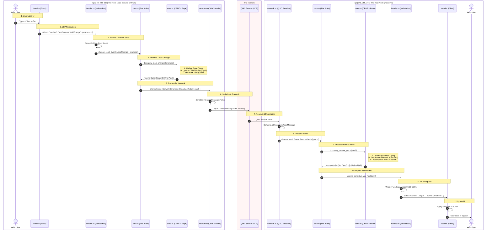

# JustSync

[]()
[]()
[](LICENSE)

**JustSync** is a high-performance, real-time code synchronization tool designed for Neovim and LSP-compliant editors.

It utilizes **CRDTs (Conflict-free Replicated Data Types)** for mathematical consistency and **QUIC** for low-latency transport, ensuring that collaborative editing feels native, even over unreliable networks.

> **⚠️ Alpha Warning:** This software is currently in active development (v0.2.0). While the core synchronization logic is stable, edge cases may still exist. Use with caution on critical data.

---


https://github.com/user-attachments/assets/9f55f365-05b3-486a-89fd-d1e441ab1f36


---

## 🚀 Key Features

* **Conflict-Free Editing:** Powered by [diamond-types](https://github.com/josephg/diamond-types), JustSync merges concurrent edits automatically without conflicts using state-of-the-art CRDTs.
* **Blazing Fast Transport:** Uses **QUIC** (via `quinn`) instead of TCP/WebSockets, reducing head-of-line blocking and latency.
* **Cursor Stability:** Implements an efficient differential update algorithm (`ropey` + custom diffing) to ensure the cursor never jumps or resets during remote updates.
* **Echo-Loop Protection:** Features a robust, timestamp-based "Echo Guard" that intelligently distinguishes between local user input and remote echoes, preventing infinite sync loops.
* **Editor Agnostic Protocol:** Built to interface with any editor that supports the Language Server Protocol (LSP) or standard stdin/stdout text manipulation.

---

### A typical data flow would look something like


```mermaid
sequenceDiagram
    autonumber
    
    box rgb(240, 248, 255) The Peer Node (Source of Truth)
        actor PeerUser as Peer User
        participant PeerEditor as Neovim (Editor)
        participant PeerHandler as handler.rs (stdin/stdout)
        participant PeerCore as core.rs (The Brain)
        participant PeerState as state.rs (CRDT + Rope)
        participant PeerNet as network.rs (QUIC Sender)
    end

    box rgb(255, 245, 245) The Network
        participant Internet as QUIC Stream (UDP)
    end

    box rgb(245, 255, 245) The Host Node (Receiver)
        participant HostNet as network.rs (QUIC Receiver)
        participant HostCore as core.rs (The Brain)
        participant HostState as state.rs (CRDT + Rope)
        participant HostHandler as handler.rs (stdin/stdout)
        participant HostEditor as Neovim (Editor)
        actor HostUser as Host User
    end

    note over PeerUser, PeerEditor: 1. User types 'x'
    PeerUser->>PeerEditor: Types 'x' into buffer

    note over PeerEditor, PeerHandler: 2. LSP Notification
    PeerEditor->>PeerHandler: stdout: {"method": "textDocument/didChange", params: {...}}

    note over PeerHandler, PeerCore: 3. Parse & Channel Send
    PeerHandler->>PeerHandler: Parse JSON -> Rust Struct
    PeerHandler->>PeerCore: channel send: Event::LocalChange { changes }

    note over PeerCore, PeerState: 4. Process Local Change
    PeerCore->>PeerState: doc.apply_local_changes(changes)

    note right of PeerState: A. Update Rope (View)<br/>B. Update CRDT Oplog (Truth)<br/>C. Generate binary patch
    PeerState-->>PeerCore: returns Option[Vec[u8]] (The Patch)

    note over PeerCore, PeerNet: 5. Prepare for Network
    PeerCore->>PeerNet: channel send: NetworkCommand::BroadcastPatch { patch }

    note over PeerNet, Internet: 6. Serialize & Transmit
    PeerNet->>PeerNet: Serialize into WireMessage::Patch
    PeerNet->>Internet: QUIC Stream Write (Frame + Bytes)

    %% --- Crossing the boundary ---

    note over Internet, HostNet: 7. Receive & Deserialize
    Internet->>HostNet: QUIC Stream Read
    HostNet->>HostNet: Deframe & Deserialize WireMessage

    note over HostNet, HostCore: 8. Inbound Event
    HostNet->>HostCore: channel send: Event::RemotePatch { patch }

    note over HostCore, HostState: 9. Process Remote Patch
    HostCore->>HostState: doc.apply_remote_patch(patch)

    note right of HostState: A. Decode patch into Oplog<br/>B. Fast-forward Branch (Checkout)<br/>C. Reconstruct Text & Calc Diff
    HostState-->>HostCore: returns Option[Vec[TextEdit]] (Minimal Diff)

    note over HostCore, HostHandler: 10. Prepare Editor Edits
    HostCore->>HostHandler: channel send: (uri, Vec<TextEdit>)

    note over HostHandler, HostEditor: 11. LSP Request
    HostHandler->>HostHandler: Wrap in "workspace/applyEdit" JSON
    HostHandler->>HostEditor: stdout: Content-Length: ... \r\n\r\n {"method":...}

    note over HostEditor, HostUser: 12. Update UI
    HostEditor->>HostEditor: Apply text edits to buffer
    HostEditor->>HostUser: User sees 'x' appear
```

### The "Echo Guard"
One of the hardest problems in LSP synchronization is the "Echo Loop," where the editor sends back changes the network just applied. JustSync solves this using a Timestamped Content Lock. It verifies if the didChange event matches the expected state within a tight time window, silently dropping echoes while allowing concurrent user edits to pass through.

## 📦 Installation

The installation is a 3-part process

### Part 1: Obtaining the binary

In order to use JustSync, the just_sync binary must be globally accessible on each peer's system.

#### Obtaining the binary

To obtain the binary itself, currently there are 2 options:

**Obtain from release**

Under the [releases page](https://github.com/Tanzkalmar35/JustSync/releases) you can find pre-built binaries. From there, 
you can just download the newest binary.

**Build from Source**

```Bash
git clone https://github.com/Tanzkalmar35/JustSync
cd JustSync
cargo build --release
```

This will build the application with release optimizations, and place the binary under `/path/to/JustSync/target/release/just_sync`.

#### Making the binary functional

Now that you have the binary, next step is to make it globally accessible and usable.

* Linux

```Bash
sudo chmod +x /path/to/binary
sudo cp /path/to/binary /usr/local/bin
```

* Windows

1. Create a folder for your binaries if you don't have one (e.g., `C:\bin`).
2. Move `just_sync.exe` into that folder.
3. Add that folder to your **User PATH**:
   * Search for "Edit the system environment variables" in the Start menu.
   * Click **Environment Variables**.
   * Under **User variables**, select `Path` and click **Edit**.
   * Click **New** and paste the path to your folder (e.g., `C:\bin`).
   * Restart your terminal.

* MacOS

```Bash
# 1. Make the binary executable
chmod +x /path/to/binary

# 2. Move it to a folder in your PATH
sudo cp /path/to/binary /usr/local/bin
```

> **Note for MacOS:** If you downloaded the binary from GitHub Releases, you might need to allow it in **System Settings > Privacy & Security** if the OS blocks it as "unverified".

### Step 2: The editor extension

Each peer must install the JustSync extension in the editor of their choice. Currently supported extensions are:

*   **Neovim:** [../../extensions/neovim](../../extensions/neovim)
*   **VS Code:** [../../extensions/vscode](../../extensions/vscode)
*   **IntelliJ IDEA:** [../../extensions/jetbrains](../../extensions/jetbrains)

You can find directions on installing each one by following the respective link.

### Step 3: The relay server

In order to give each peer the ability to work in a network without the hosting peer needing to port forward, 
I introduced a simple relay server. All this relay server does it hotwire each peer to each other peer.

You can either use a public relay server, if available, or self-host a relay server. These relay servers are truly zero-knowledge. 
As all the sensitive communication (all communication after the setup) is protected by E2EE by each peer, you're safe to use
public relay servers, again, if any are available. For the current scope none will be available, but if I get to know some, I'll list them here.

If you want to self-host the relay server however, please follow [the according instructions](https://github.com/Tanzkalmar35/JustSync/tree/master/crates/server).

## 💻 Usage

Using JustSync after having it set up is pretty straight forward, you just interact with the editor extension. 
Exactly how each editor extension works you can find out by following the respective links.

*   **Neovim:** [justsync.nvim](https://github.com/Tanzkalmar35/JustSync/tree/master/extensions/neovim)
*   **VS Code:** [justsync-vscode](https://github.com/Tanzkalmar35/JustSync/tree/master/extensions/vscode)
*   **IntelliJ IDEA:** [justsync-jetbrains](https://github.com/Tanzkalmar35/JustSync/tree/master/extensions/jetbrains)

## 📄 License
This project is licensed under the GNU Affero General Public License v3.0 (AGPLv3).
